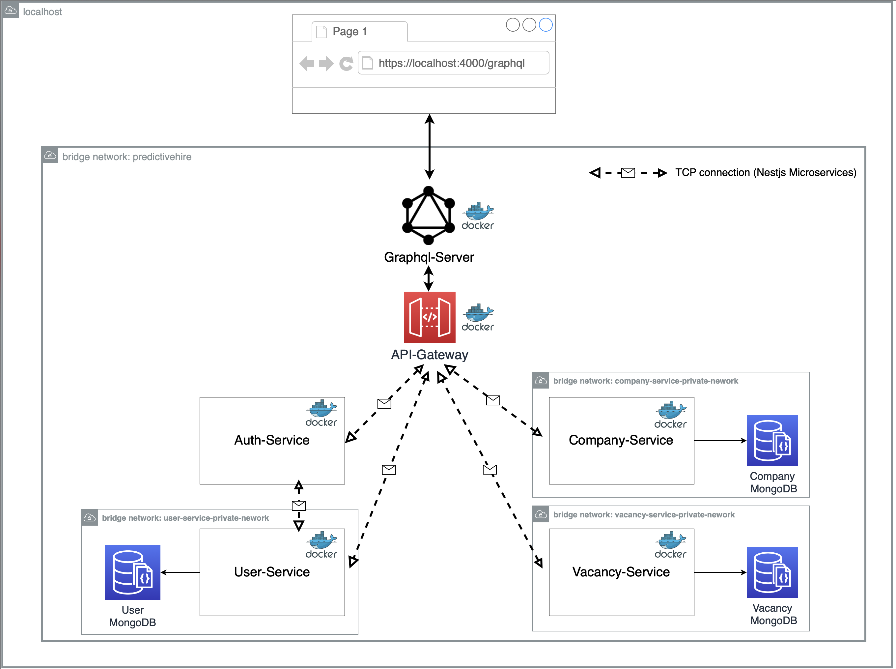

# PredictiveHire Code Test 

This demo project is containing a GraphQL Server + REST API gateway with back-end microservices all written using the NestJS Framework and TypeScript

## Architecture Overview
 
The GraphQL server receives the requests from client side and fetch data by calling RESTful API, ultimately it will return aggregated data to client side. 

The REST API acts as a gateway/proxy for the different microservices it exposes.

The controllers of the REST API make calls to the servers/microservices in the back-end through [TCP](https://docs.nestjs.com/microservices/basics).

The Nestjs microservices then handles the request to connect to databases or any other service it needs to serve requests.

All the components(GraphQL, API Gateway, microservies) are dockerized and for simplicity purpose, these containers are all in bridge network, so that they are visible to outside through its service name.
### Diagram

A diagram of the architecture is shown below.



## Deployment

Deployment is done with containers in mind. A Docker Compose file along with Dockerfiles for each project are given to run the whole thing on any machine. For production, it's always recommended to use [Kubernetes](https://kubernetes.io/) for these kinds of microservices architecture to deploy in production.

## Naming convention
The service folder is named by [service name]-[service default port]. E.g. api-gateway-3000 

## Naming convention
The service folder is named by [service name]-[service default port]. E.g. api-gateway-3000 

## How to Run

System Requirements - Linux/Mac should be better, I did not test Windows yet
- [Node.js](https://nodejs.org/en/) - v12 Required (You can run ```nvm use``` to install the desired node version which already been defined in .nvmrc)
- [Docker](https://docs.docker.com/install/) - latest
- [Docker Compose](https://docs.docker.com/compose/install/) - latest

### Production

Please check the `.env.prod` first to see which port you would like to use

1. On the Terminal, go into the project's root folder (`cd /project/root/folder`) and execute `docker-compose -f docker-compose.yml --env-file .env.prod build
`. The docker will start building the image and it may take a while. After the images are build, execute `docker-compose -f docker-compose.yml --env-file .env.prod up` to run the docker containers.

2. Once all the containers are on, the GraphQL server will listen on `http://localhost:4000` by default

### Local Development

Please check the `.env.dev` first to see which port you would like to use

1. On the Terminal, go into the project's root folder (`cd /project/root/folder`) and execute `yarn`, then execute `docker-compose -f docker-compose.dev.yml --env-file .env.dev build
`. The docker will start building the image and it may take a while. After the images are build, execute `docker-compose -f docker-compose.dev.yml --env-file .env.dev up` to run the docker containers.

2. Once all the containers are on, the GraphQL server will listen on `http://localhost:4000` by default, and all the services are running in development --watch mode. So you can debug the code, and the services will be hot-reloaded.

### Unit test
1. On the Terminal, go into the project's root folder (`cd /project/root/folder`) and execute `yarn test`

### e2e test
1. On the Terminal, go into the project's root folder (`cd /project/root/folder`) and execute `yarn test:e2e`

## Play with this demo App 

Once the GraphQL server is on, you can use the playground to Query / Mutate some data.

In this app, I didn't save any default data in the mongoDB, so before starting playing, please execute the following
script to insert ONE company and TWO users.

```
mutation {
  createCompany(input:{name:"Predictivehire", address:"15 Newto St"}) {
    _id
  }
}
```
please remember the _id, that's the companyId for user.

```
mutation{
  register(input:{name:"Bob Markle", username:"bob", password:"bob", role:"user", companyId:"<companyId>"}){
    _id
  }
}

mutation{
  register(input:{name:"Mark Smith", username:"mark", password:"mark", role:"admin", companyId:"<companyId>"}){
    _id
  }
}
```

Once abvoe steps are done, you can play with the app according to the API Usage instruction.

### Concerns

Due to time limit and simplicity purpose, here are some highlights I didn't do but have in mind:
1.  `.env.dev` and `.env.prod` shouldn't be committed, the env variable value should be injected dynamically.
2.  I only implement unit test and e2e test for a small partial of the code, but hopefully they can assist you to have
 a taste on how I coded
3.  All the microservices connected through TCP in this demo, but in mose cases, the services will be distributed in different host / region,
so using RabbitMQ or Kafka can help decouple the services and improve the system performance.
4. No load balance yet.
5. No service registry center yet.
6. No cache yet.